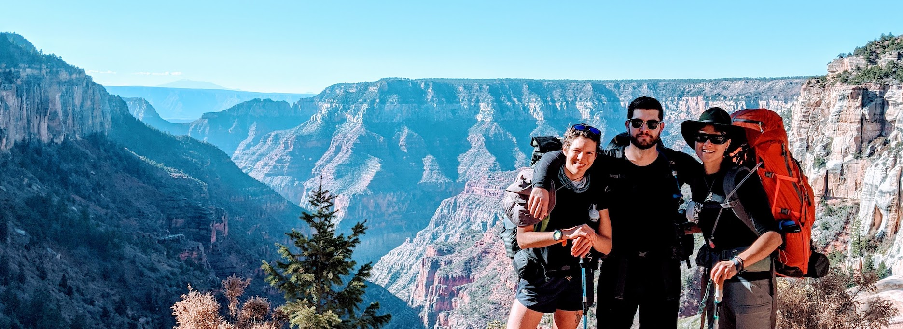

<h3 align="center"> Hi there, I'm Alex (he/him) :wave:</h3>

<h3 align="center">Let's Connect!</h3>

   &nbsp;&nbsp;
   &nbsp;&nbsp;

* Contact: me@alexkio.com
* Portfolio: [https://alexkio.com/](https://alexkio.com/)
* LinkedIn: [https://www.linkedin.com/in/alexkio/](https://www.linkedin.com/in/alexkio/)
<!-- * ✍🏼 &nbsp; [Medium - Where I write about learning](https://alexmkio.medium.com/) -->
* I'm currently a Mod 3 student in [Turing School of Software and Design's](https://turing.io/) Frontend Engineering program (*anticipated completion:* **October 2021**)

#### About Me
- I am an avid [cyclist](https://bikerumor.com/2019/05/28/bikerumor-pic-of-the-day-riffrafting-on-the-santa-fe-river-florida/) and aspirational [frame builder](https://willadean.com/).
- Lover of backpacking and riding bikes up mountains.

#### Projects
- Looking to contribute to non-profit organizations open source projects.
- I am building an open source ipsum lorem generator. I'll tell you more about it when it's further along.

#### I'm Currently Learning
- Python
- PostreSQL
- MongoDB

#### Ask Me About...
- My favorite rootbeer 🍺

#### Profeciencies
 <table>
    <tr>
        <td>JavaScript</td>
        <td>HTML5</td>
        <td>CSS3</td>
        <td>Sass</td>
        <td>React</td>
        <td>Router</td> 
        <td>NPM</td>
        <td>Express</td>
        <td>Cypress</td>
        <td>Mocha</td>
        <td>Heroku</td>
    </tr>
    <tr>
        <td></td>
        <td></td>
        <td></td>
        <td></td>
        <td></td> -->
        <td></td> 
        <td></td>
        <td></td>
        <td></td>
        <td></td>
        <td> </td>
    </tr>
</table>

#### Stats

  

